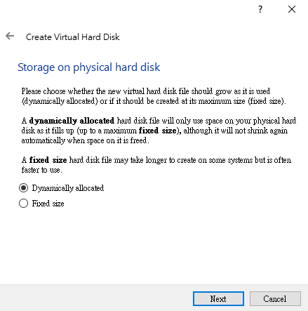
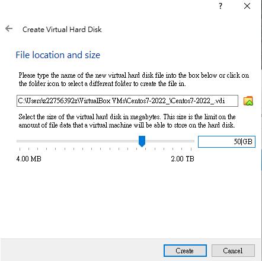

## 目標

how to install linux (centos)

using:

virtualbox(vmware greater but not free) + centos 7

centos : stable ,long term , many support, free popular in samll and medium business

There are many linux disturbution, for example redhat,ubantu.., but mostly they are alike, we can easily switch to others disturbution. 

-install virtualbox

-create virutal machine:

dynamically allocated用多少存多少(大部分)

fixed size (相對速度較快但檔案大)

choose big size, no worry, because we choose dynamically allocated. It still store how much we store.

-install new software(centos) in to this virtual machine

[VirtualBox安装CentOS 7教程（超详细）_┌D调dě浪漫的博客-CSDN博客_virtualbox安装centos7](https://blog.csdn.net/qq_43726042/article/details/105913613)

相似這個 不過root 帳密是centos centos