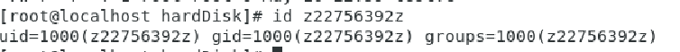
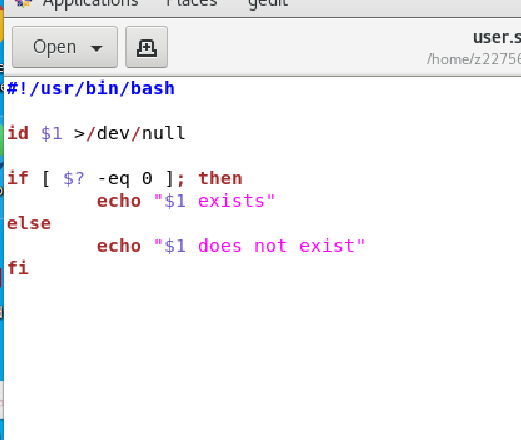
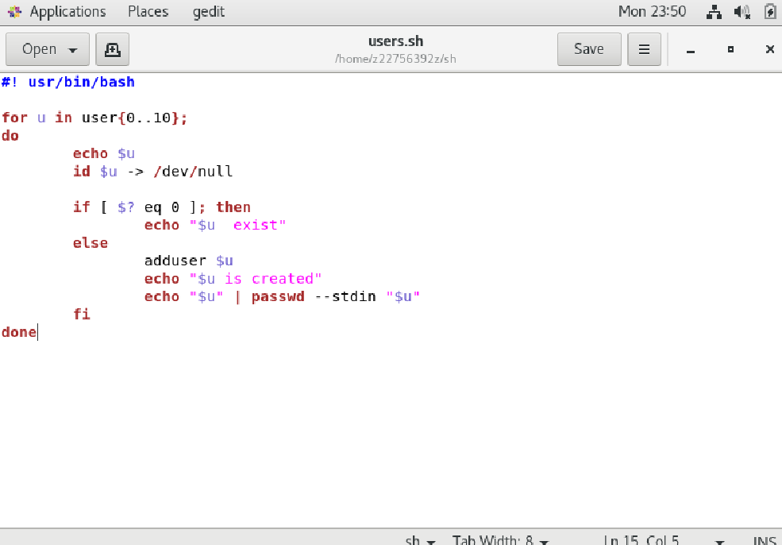
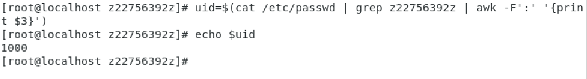
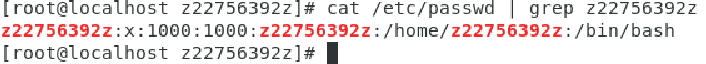

## Command

``lsblk -f``: 

``~+``:  == ``pwd``  => current working directory  (ex: echo ~+)

``~-``: previous working directory (ex: cd ~-) 

`` echo "a b c" | mkdir `` : wrong , not all command can read standard input such as mkdir

``echo "a b c" | xargs mkdir``: correct ,xargs 可以将管道或标准输入（stdin）数据转换成命令行参数

``which bash`` : 找執行黨(bash)

## 掛載

[CentOS Linux mount exfat 格式硬碟 @ Hello World :: 痞客邦 :: (pixnet.net)](https://helloworld.pixnet.net/blog/post/47458574-centos-linux-mount-exfat-格式硬碟)

* mnt

* media

* run

```
mount -t exfat /dev/sdb /media
```

partition --> format --> mount


## User

one user can belong to many groups

``id user`` : show the info of user or test if exist



z22756392z 加入 一個群組 gid是主要群組 groups是全部加入的群組

groups 之後有 wheel 代表this user can change to super user

in centos system, uid < 1000 (system account), >=1000 (normal user account)




判斷 user 在不在的script

$1 第一個輸入參數

$? 上一個指令是否執行成功 (成功 == 0)

```
if [ $? -eq 0 ]; then
```

等於

```
if [ $? -eq 0 ]
then
```

**創造10個user 帳號和密碼都為 user1 , user2.... user10** 



```
for u in user{1..10}
```

u = user1

u = user2

...

u = user10


```
echo "$u" | passwd --stdin "$u"
```

--stdin  

This option is used to indicate that passwd should read the new password from standard input, which can be a pipe


**Check user group**



```
awk -F':'
```

預設awk是以空白來區分 但這裡是':' awk -F 就是用來告知指令用什麼字元區分

