## Ch8

program vs process

program以檔案的形式儲存在儲存空間

A process is a running program.

* process id(PID)


First process in linux: ``systemd ``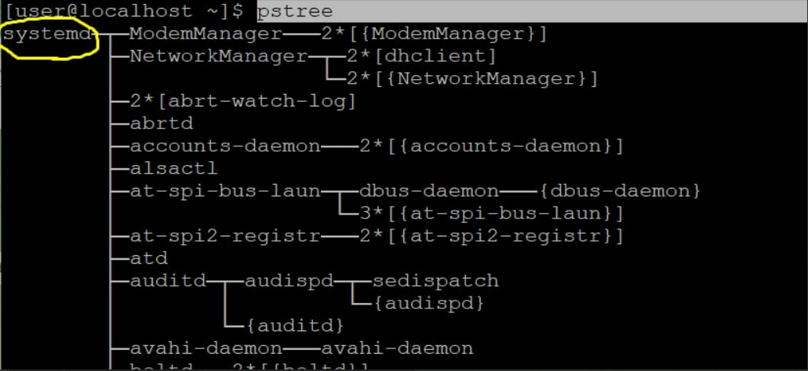

init vs systemd: init => systemd 

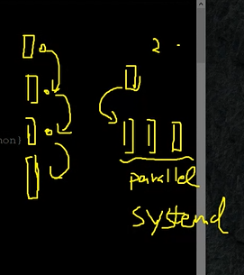

`top` : system status, up time(open computer till now), online user, load average ....


systemd PID is 1 , because it is the first program to be executed.

`uptime` :

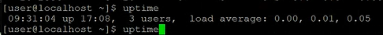

`free`:

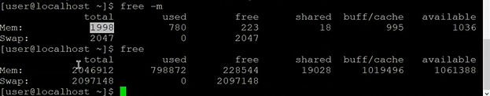

---

`ps`:

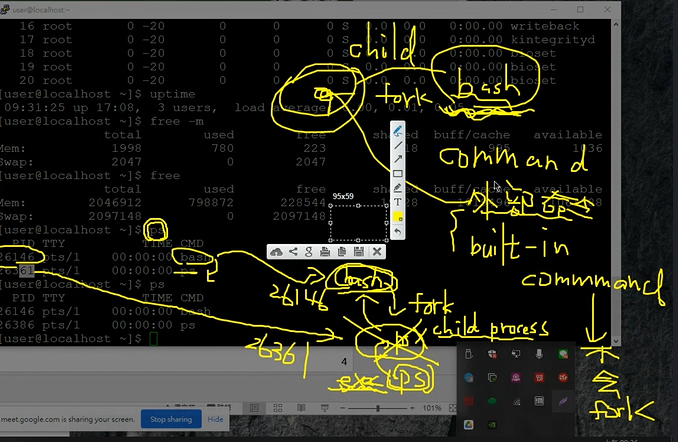

```c
/// not built in command
#include <stdio.h>
#include <unistd.h>
#include <sys/types.h> 
#include <sys/wait.h>

int mysystem(char *arg[]) {
  if (fork()==0) {
    execvp(arg[0], arg); // child : exec("ls -l")
  }
  int status;
  wait(&status);
  return status;
}

int main() {
  char *arg[] = {"ls", "-l", NULL };
  mysystem(arg);
  printf("main end!\n");
}

```

built in command vs not built in command

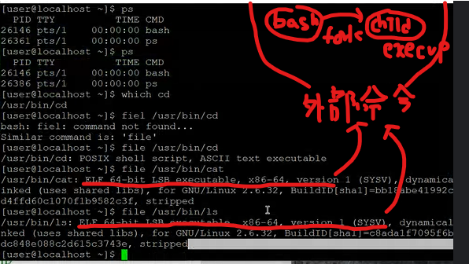

[Bourne shell 內建指令的清單 - IBM 說明文件](https://www.ibm.com/docs/zh-tw/aix/7.1?topic=shell-list-bourne-built-in-commands)

`ps aux`: 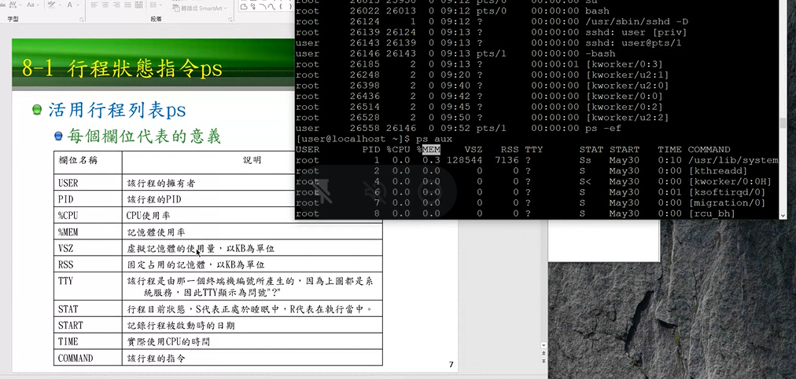

在查詢的時候 也會跑一個process  加[]  (加在哪裡都可以 [c]ron == cr[o]n == cro[n] 跟正規表達是有關)就不會顯示

crond is related to time . 可以指派每個工作 時間到了某個指令會執行 (用於排成)

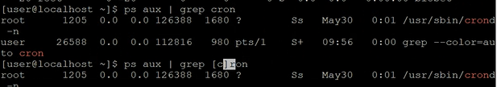


`echo $$ `: to show current PID

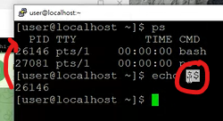

[Linux pstree 以樹狀圖顯示行程相關性指令教學 - G. T. Wang (gtwang.org)](https://blog.gtwang.org/linux/linux-pstree-command-tutorial/)


`time  command`: how many time the command used to execute


`Ctrl + C` : break program

`Ctrl + Z`: stop current foreground program and put it in the background

`bg pid`: change background job status to running

`fg pid`: get the job from background

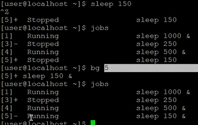

Nice value is a user-space and priority PR is the process’s actual priority that use by Linux kernel

`ps o comm,pid,ni`:

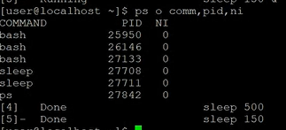


`sudo !!`:  !!== previous command

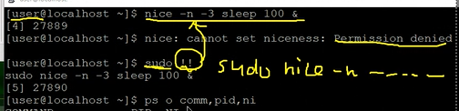

`kill pid`: 正常結束

`kill -9 pid`: 強制結束

`kill -1 httpd_pid`: 網頁伺服器重新加載配置檔

`pkill httpd`: all the hpttd process will be killed