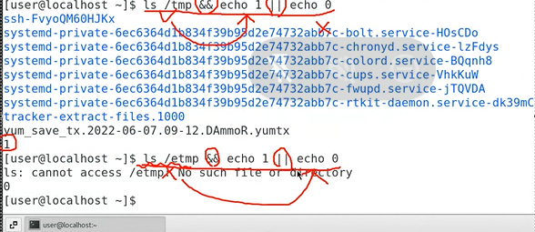
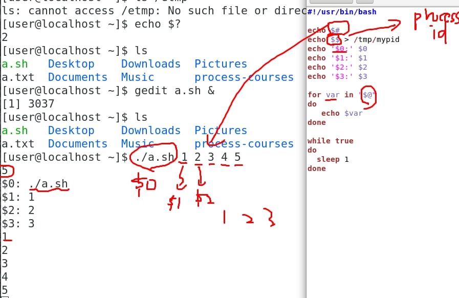

## Command

``&&`` : 如果 ls/tmp 執行成功 才會執行 &&之後的 echo 1

`||`: 如果 ls /etmp 執行失敗 echo 1 不會執行 echo 0 執行




指令可以分成兩種 builtin command 和 normal command

bulitin command: 在本身的行程執行

normal command: fork 在小孩執行

​	 


`(a = 10 ; echo $a)`: bash產生 child行程 a = 10; echo 10 執行結束 child行程死掉 , bash回收

### 取變數值

`echo ${a}` == `echo $a` 普通情況下 大括號是不用加的, 完整的取變數的方式是加大括弧

`a = 10; echo  a${a}a`: 執行結果: a5a

`a = 10; echo a$aa`: 執行結果: a

----

`$$`: pid,行程ID

`$?`: 前指令執行成功 回傳 0, 執行失敗 回傳 非零值

`$#`: 參數的數量

`$_`

`$@`

`!!`




>  zombie
>
>  雖然子行程已經結束了 但因為 父行程 還沒結束 子行程變成了殭屍 佔用空間等待父結束

```c
//zombie
#include <unistd.h>
#include <stdio.h>
#include <stdlib.h>
#include <sys/types.h>

int main(void)
{
        pid_t pid;

        printf("parent : %d\n", getpid());

        pid = fork();

        if (pid == 0) {
                printf("child : %d\n", getpid());
                sleep(2);
                printf("child exit\n");
                exit(1);
        }

        /* in parent */
        while (1)
        {
                sleep(1);
        }
}

```

> orphan process
>
> 就是跟zombie 相反 父行程已經結束 但子行程還沒結束, 之後可能被 systemd 或是 init接收變成他的父行程(就是第一個執行的行程, pid = 1的行程)


`env`: display system enviromental variables

`set`: 可以用來顯示系統的環境變亮還有自己定義的變量