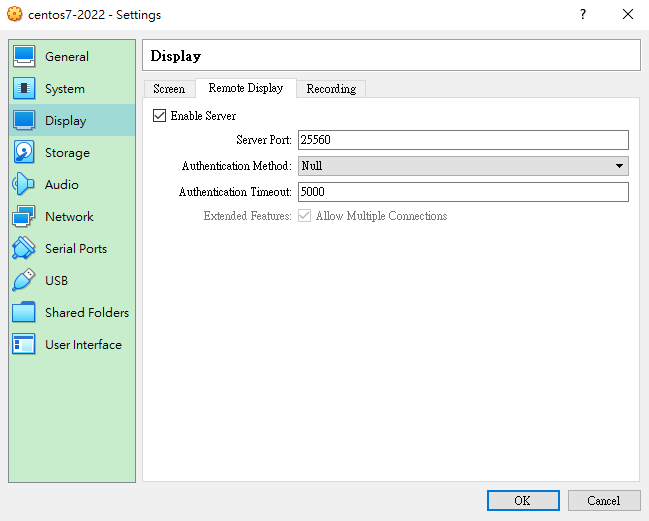
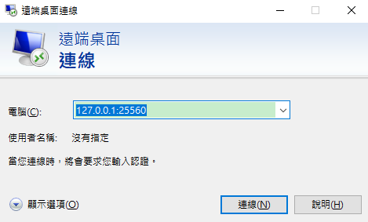
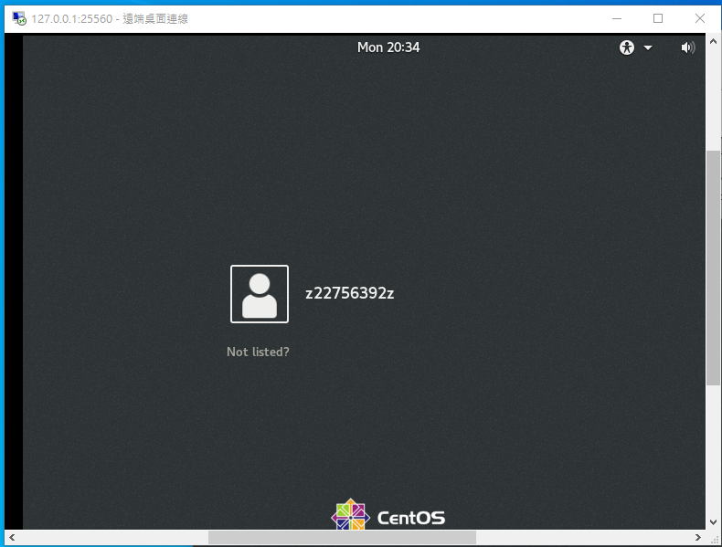
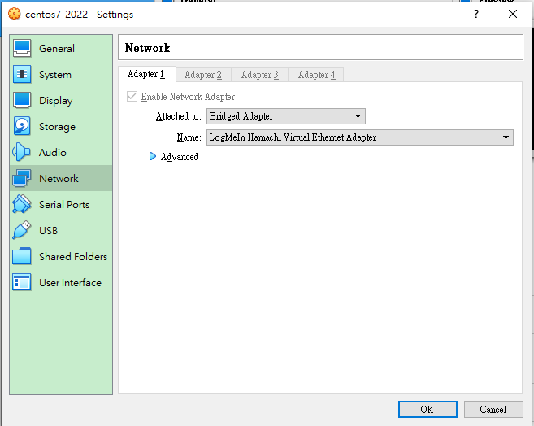
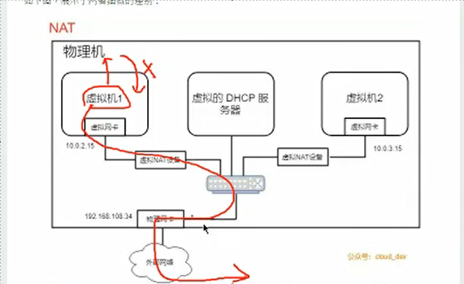
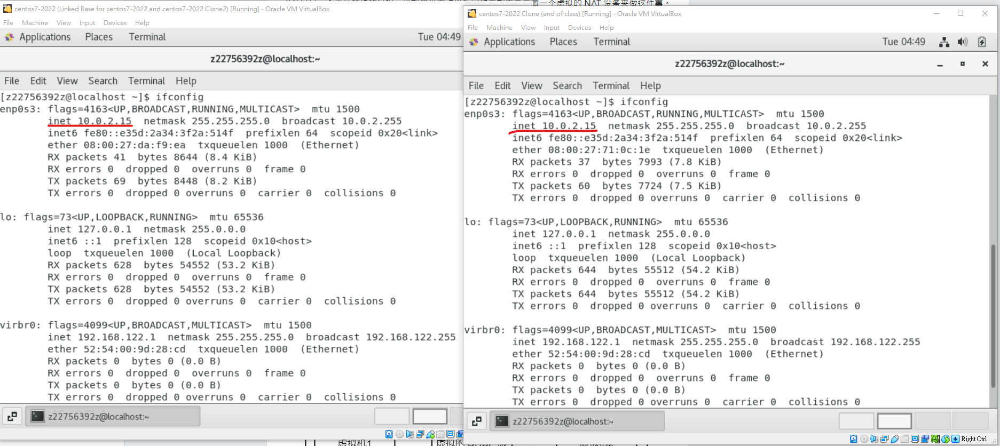
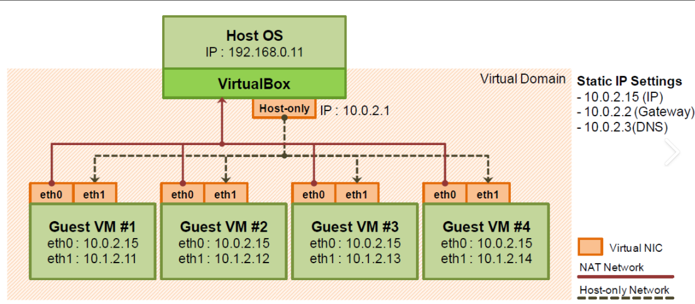
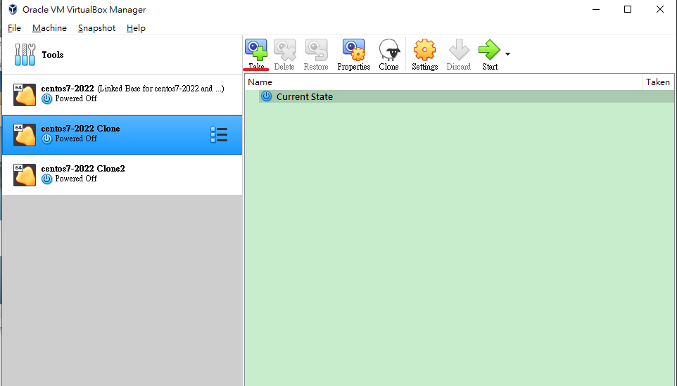
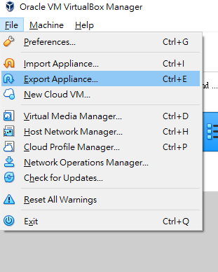
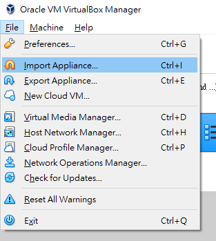

## linux伺服器

想要連線到伺服器

Rmote controller 遠端

search mstsc

因為伺服器開在本地和剛剛設置的port 直接用 127.0.0.1:25560

you can use it to remote control server, which it may be in the cloud.

## command

su (change to super user)

關機指令:

​	halt -p

​	shutdown  (if you want to shutdown the machine immediately, you should use 'shutdown now',you can also use more setting like : shutdown 5 mintute later)

​	poweroff

gedit 檔案名稱(編輯檔案)

看檔案內容:

​	cat 檔案名稱 

​	more 檔案名稱

​	less 檔案名稱

ifconfig(看ip address)

ctr + c (break command)

## Network setting

[虚拟机网络模型详解，看这篇就够了（图文并茂） - SegmentFault 思否](https://segmentfault.com/a/1190000018641361)

#### Bridge Adapter

It is a node in the internet

地位相同,window可以看到linux, linux 也可以看到window , 可以互ping,互相存取 ,therefore 他適合架設伺服器, 可以access 任何地方in internet

他們都在同個區域網路下

#### NAT mode

[Differences between bridged and NAT networking - Server Fault](https://serverfault.com/questions/490043/differences-between-bridged-and-nat-networking#:~:text=With NAT the IPs of the virtual machines,is What is strict%2C moderate and open NAT%3F)

在這個模式下 會有個virtual DHCP server 派IP 給我們的virtual machine.

VM可以看到host物理機 但 host看不到vm(ping不到)(因為他們在不同的網段),而vm可以連到外面的網路,但外面的網路無法連進虛擬機 可以想像public網路不能直接連線到私有網路裡面的東西

他們擁有相同ip位置 但是沒關西 因為他們是在不同的私有網路下,而且他們也不能互相溝通,因為他們的ip位置是相同

#### NAT network mode

10110111111

0010110100110000

0010110100110000

VirtualBox  (NAT: vm cannot talk to another VM)  (NAT Network: vm can talk to anther VM)

#### host only

virutal machine can talk to each other, and can also talk to 物理機,但不能連上internet

##### NAT 可以與host溝通

NAT + host only === bridge mode

#### Internal network

Internatl Network: VM can only to another VM that is within the same internal network. No internet connection. Cannnot talk to windows

## protection

take snapshot (我們可以儲存當下的狀態 當之後系統可能出了問題什麼的 可以回到此狀態)

## Export virtal machine

出來的檔案(exported虛擬機)也可以在VMWire使用

## Import

