## Linux Structure

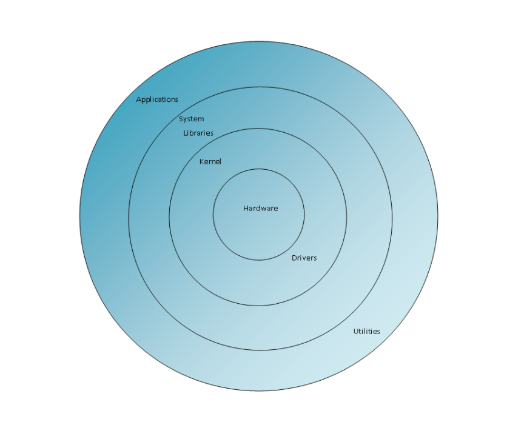

### Kernel

a language specific speaking to hardware. The kernel will interact with different hardware, turn user operation into language

#### distribution 

kernel is almost the **same** except for the fact that version may differ.

[The Linux Kernel Archives](https://www.kernel.org/)

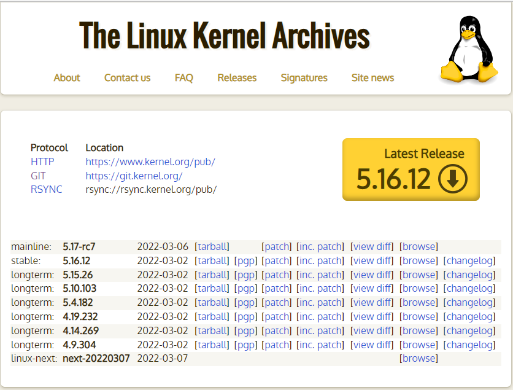

longterm(or lts : long term support, the development team will support it, when things happen they will help you fix it) >= stability > mainline

In linux world, when compared to stable, new feature is not that important.

you can download kernel's source code in this web([The Linux Kernel Archives](https://www.kernel.org/)).

#### Command

* ``uname -r`` : check kernel version => first argument 

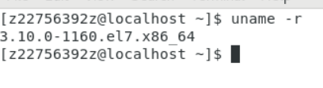

​	Inside Linux kernel, kernel's file(filename.img) is already compiled, so you won't find source code.

* ``cd /boot`` : go inside kernel

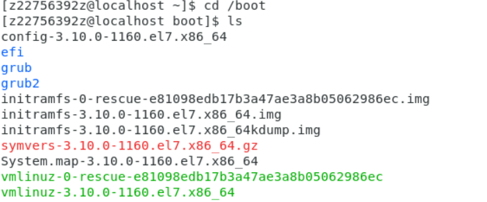

* ``ls vmlinuz*``:  ``*`` mean regular expression => it might happen 0,1...n time.  command=> find all file that has vmlinuz name in it and list it.

​	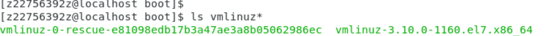

​	

​	

### Shell

shell job: translate user operation into language that kernel know

`` echo $SHELL`` : ``$`` environmental variable ,把環境變數裡面的值取出來ex: ``echo $user``: tell your identity, ``echo $ PWD ``: show path of your current working directory . Therefore , ``echo $SHELL`` will tell which shell you are using and print in your terminal.

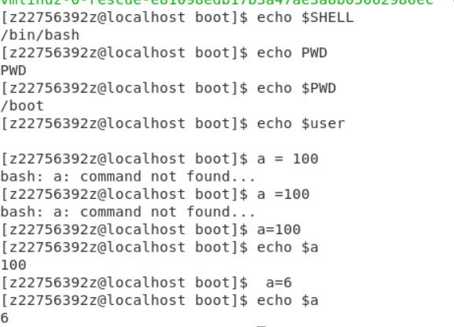

### Application

#### install

1. ``yum``: 安裝已經編譯好的軟體 

2. 下載原始碼編譯 可以調整參數客製化

   

> shell and application can be switch = > different distribution => unbuntu, centos, redhat

## Famous Distributions

red hat => stable, provide financial support for Fedora and centos community, provide service help you

Fedora => new feature, when it became more stable it will but it in centos and later red hat

centos => stable ,long term , many support, free popular in samll and medium business, but compared to red hat , there might not be others help you fix your problem

## Free software

share software to open public. When someone find bug , he will help you fix it. the software become more security, more powerful.. 

You can also modify it, make it different distribution. But you can't keep it secret , you have to put it to open public!

Free doesn't mean cost nothing, we can provide service, maintain and education.

Ex: GPL(General Public License) you can use,distribute and even modify  the software freely, but you can't keep it secret. 

> This program is free software: you can redistribute it and/or modify it under the terms of the GNU General Public License as published by the Free Software Foundation, either version 3 of the License, or (at your option) any later version.

> This program is distributed in the hope that it will be useful, but WITHOUT ANY WARRANTY; without even the implied warranty of MERCHANTABILITY or FITNESS FOR A PARTICULAR PURPOSE. See the GNU General Public License for more details.

> You should have received a copy of the GNU General Public License along with this program. If not, see <https://www.gnu.org/licenses/>. 

There are different **License** unlike GPL.

Take Apache License for example, you can modify it and keep it secret and some on.

It is essential to learn  software 's the **License**  well before we use it.

## Linux install

### How to get img file

Except official web, we can also download it in different place.  

Because if all user over the world, using official web it will crush or became slow.

 ## Linux Script

#### Edit Script

``gedit a.sh &`` : ``&`` 在背景執行讓我們編輯完成後 可以馬上回到terminal 執行

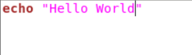

`` > a.sh``: clear the file content

``cat a.sh``: see the file content

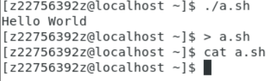

#### Run program

* ``bash a.sh``

  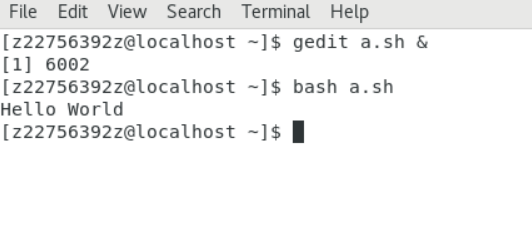

  * `` ls -l a.sh``:  在Linux副檔名只是給人參考的 不代表任何意思 真正的要看檔案權限

  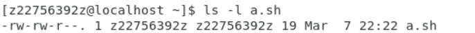

  ​		``ls -ld Music/``:  

  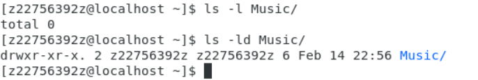

  ​		r(read)w(writable)x(execute)

  ​		owner group other

* ``./a.sh``: execute the file

  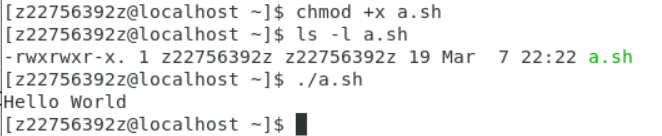

  However, before we use ``./a.sh`` command, this file is unexecutable because of its 權限.

  * ``chmod +x a.sh``: change mode add execute mod to a.sh 

​		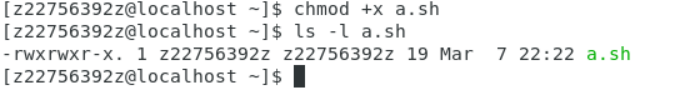

* ``mv a.sh /home/user/bin``: 把a.sh搬到系統路徑 讓我們可以直接以``a.sh`` 呼叫

  當我們今天打一個指令他會一個一個慢慢找回去

  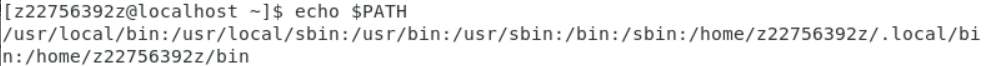 直到最後的shell(/home/z22756392z/bin)裡面 如果shell裡面有著這個command他會執行他 如果也找不到 print command not found.

  而我們把a.sh搬到 /home/user/bin 就是把它搬到shell讓他可以當作shell的command可以直接以``a.sh``執行

## Other Command

* ``passwd``: you can change the password

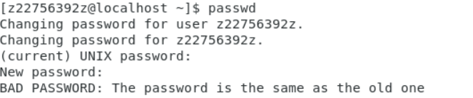

​	you can also change others user's password ``passwd user`` if you are super user.

* ``useradd newuser``: add new user(su only:#)
* ``ssh newuser@localhost``: connect to new user also make sure newuser is successfully added.