## ifconfig

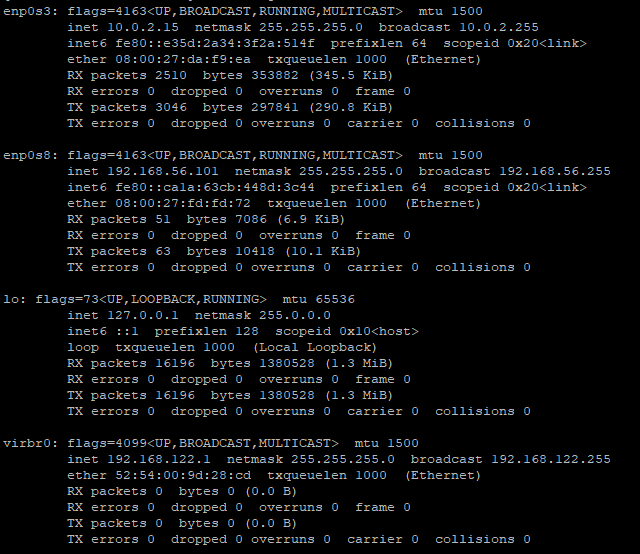

ether: 卡號

enp0s3:對window的interface

enp0s8:對網路interface

lo: loop back interface

mtu: max transmittion unit

inet6: ipv6 address

intet: ipv4 address

``ifconfig enp0s3``: only show enp0s3

``grep selectedName``  :  it can filter what you want

``Acommand | Bcommand`` : a pipe , Acommand result will be the input of Bcommand  

``ifconfig enp0s3 | grep netmask`` : the enp0s3 interface info will be filter and show netmask info, which in result will only show the netmask in enp0s3.

` awk '{print $number}'` : filter out the  ``$number`` th column

``ifconfig enp0s3 | grep broadcast | awk '{print $2}'`` :  get the ifconfig enp0s3 command result and get to another command, grep broadcast, which filter out the broadcast line only, and then, the result of it get to another command, awk '{print $2}', which mean filter out the second column of all line.

``grep -v Name``: if result fit Name it drop.

``ifconfig | grep inet | grep -v inet6 | awk '{print $2}'`` : filter out all info which has inet name, and drop all which name is inet6, and print column 2

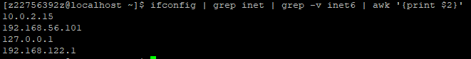

``ifconfig interfaceName 0``: clear all the setting for this interface (super user only), **also clear default router**

``ifconfig enp0s3 10.0.2.15 netmask 255.255.255.0 broadcast 10.0.2.255`` : set interface setting

However, despite, all the setting we has setup, it still can't access the internet.

Because, the default router (gemask and destination is all 0s) is unfoundable.

Therefore, the package can't go to default router.

``ip route add default via 10.0.2.2`` : add default router

``ping -c 1 8.8.8.8`` : -c count, ping once

Usually mac address is unwritable because it is written in hardware.

However, in here it is just a record, we can modify it.

Which make others hard to trace us compared to fixed address...

``ifconfig enp0s3 hw ether 00:00:00:00:00:01``: change the mac address, but reboot it will recover.

## file system

In all the file sytem, their  individual file size, max number of file has their own upper limit..

* FAT32 : 記憶卡 sd card, a file which excess over 4g can not be store
* NTFS : usally used in window 
* EFAT: extend FAT , 
* ext2,ext3,ext4,xfs.. : usually used in linux, it has many file system because linux is a open system it can support lots of file system. and how it support so many different file system is using the method called VFS.

Choose different file system in different circumstances.

Or you can customize ,partiton it yourself.

## Partition

There are different partition

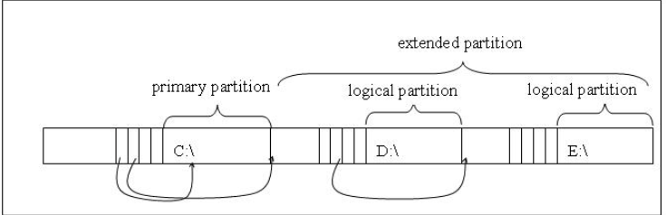

* primary -> usually c drive , d drive .... f drive at most five drive, but you can partition it to many partition like above.
* extend
* logic

### Linux

**In linux we at least need two partition ** we can  use 2p,1p + 1l.. whatever we want. but at least two parition.

one partitionis corrsponding to to root ``/``, below we can see etc, bin folder...

### directory tree

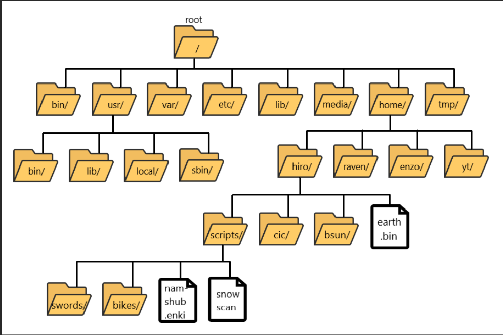

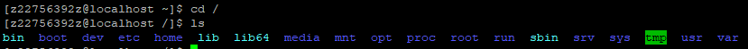

and the other partition is called swap.

swap: use harddriver to simulate memory, to extend memory size(lose efficiency).

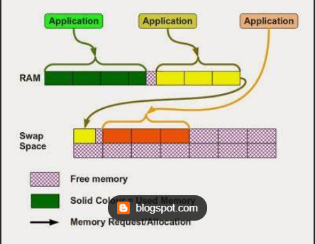

In our virutal machine, it is usually we don't have enough space to run applicatoin, therefore swap is used for this circumstances.

We use harddrive to simulate the memory. Howevere the processing speed in hard driver is slower.

In window every partion is one solt, but in linux there's nothing like it.

We have directory tree.

Usually one root directory is corrsponding to one partition.

However we have VSF, we can make one directory into another partition(we call it: **mount**).

> VFS: virtual file system, used in order to support lots of file system.

Ex: when we use USB  we can ,for instance, use one of directory in root to make it as parition. The original data in it will be hided. All we see in it is the new data, in this example, what we see is USB content.

And when USB is take out. The directory will become its usual self, the hided data will appear and new data disappear. 

With VFS we can make linux file system more flexible. For instance, in different file system, when we enter command or do something with that partition, maybe the commands in low level are different and maybe the manipulation it do is also different. But for us, the user, the command is completely same.  

Usually we will partition ``/boot`` to store 開機有關的映象檔 

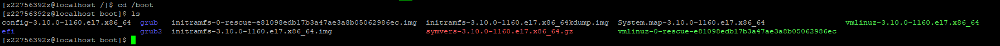

or ``/home`` in linux, each user has it  directory in home directory, limit user size, it have  seperate partition. If it have the partition as root, it is not easy to limit user size. So we partition it to seperate it. It is easier to do so. 

## corneal load

When we reboot the computer.

There a bios in motherboard. When we power up the computer it check ... and go to hardware check very sepcialic location called mbr it will the boot loader (in linux called grub), and go to the cornel ,and choose the cornel we want to use, put it into memory and execute it. 

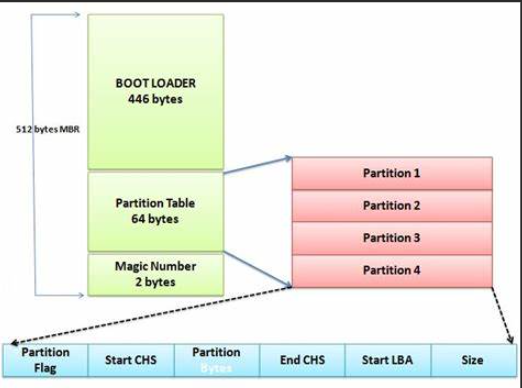

it is first program to load ``init`` and then enviromental viarble, 

After this state, it has different initalize mode first called runlevel 0 , it is also the place where we changed the super user password, and do some hardware check or fixing.

runlevel 5 is graphic

runlevel 3 is only text

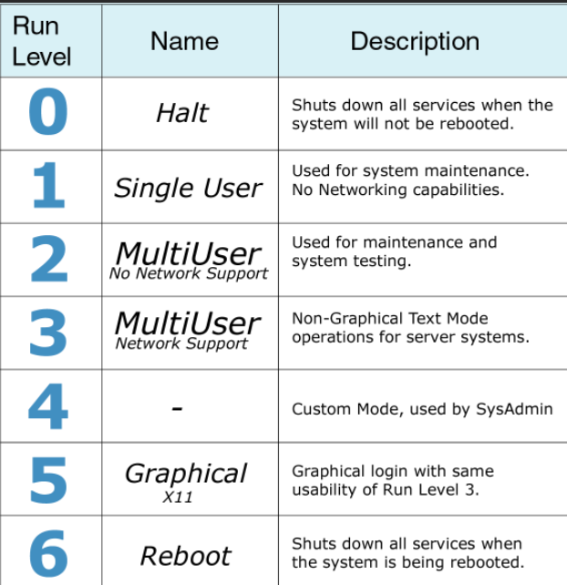

## Command

``history``: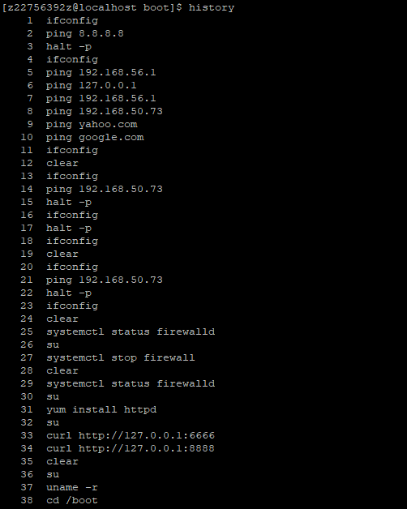

``!number``: it will execute the command corrsponding to the number in front of the command

``!symbol``: it will search from buttom to top to execute the command which fit the symbol you type and execute the command

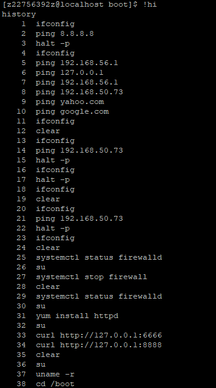

``hostname``: get host name

``hostnamectl set-hostname newName`` : change host name 