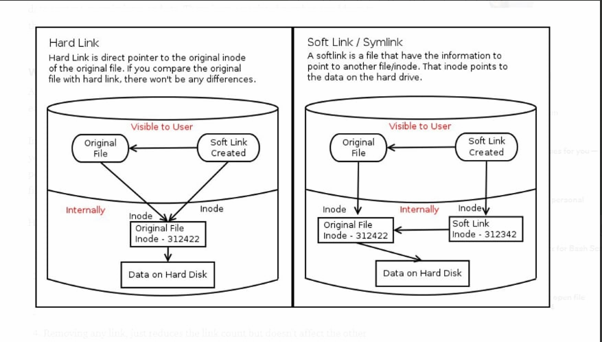
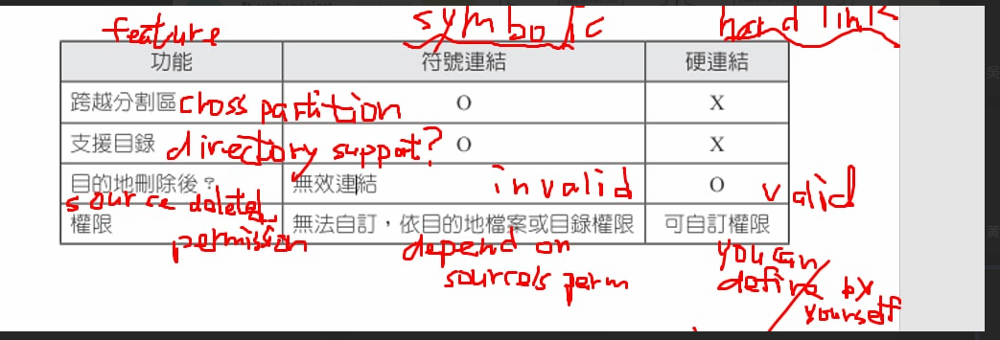

[RHEL / CentOS 7 編譯核心 - Linux 技術手札 (ltsplus.com)](https://www.ltsplus.com/linux/rhel-centos-7-compile-kernel)

## Command

``uname -r`` : show kernel

``wget urllink``: download file without open browser

``tar -xvf --linux_version`` : decompress file

``sudo -l user`` : Let the user know if he has the right to switch to super user, and if he can execute those super user commands

``cd -``: change directory back to original directory(``-`` mean original directory)

``cd ~ ``: go back to user's home directory

``man ls `` : manual for linux command or c function ``man 2 fopen`` 

``echo $?``: you can use command to see whether the previous command is executed successfully or not. if previous command is successful it return 0, otherwise return non-zero value

``cat -n etc/passwd | more`` : -n show the number of each column

``cat -n etc/passwd | head -n 10 | tail -n 6``: filter 5th to 10th info out

``cat -n etc/passwd | sed -n "15,30p"``: p mean print, also filter 5th to 10th info out

``touch``:touch is used to create a new file or change the access/modify/change time.

``echo "3" >> a.text`` : append "3" to a.text

``echo "2" > a.text`` : replace a.text to "2"

``mkdir -p a``: -p mean when a exists, do nothing. when a doesn't exist, it create a directory

``mkdir -p a/b/c/d``: make directory a , inside a has b directory, inside b directory is c directory, inside c directory has d directory

``rm -rf a`` : delete all the directory under a

``cat <<EOF > a.text`` : after editing the content output content to a.text , ``<<EOF`` it is just the symbol to mark the editing is done. For example if user input"hello world\n 123\n EOF", EOF will take us out of editing 	

``cat <<EOF >> a.text`` : same but append the content to a.text

## compile kernel

the reason why we use it:

some kernel may have severe vulnerability , we can use different kernel

`` cd /usr/local/src``

``wget https://cdn.kernel.org/pub/linux/kernel/v4.x/linux-4.17.12.tar.xz``

``tar -xvf linux-4.17.12.tar.xz``

``cd linux-4.17.12/``

``cp -v /boot/config-3.10.0-862.6.3.el7.x86_64 /usr/local/src/linux-4.17.12/.config``

``cd /usr/local/src/linux-4.17.12/``

``make menuconfig``: make custom configuration for kernel like to open some feature or close some function

``make bzImage``

``make modules``

``make``

``make modules_install`` 

``make install``

## FileSystem

Centos : XFS

----

``cat -n etc/passwd | more`` :

> 一些系统中，存放着加密后的用户口令字。虽然这个字段存放的只是用户口令的加密串，不是明文，但是由于/etc/passwd文件对所有用户都可读，所以这仍是一个安全隐患。因此，现在许多Linux系统（如SVR4）都使用了shadow技术，把真正的加密后的用户口令字存放到/etc/shadow文件中，而在/etc/passwd文件的口令字段中只存放一个特殊的字符，例如“x”或者“*”

