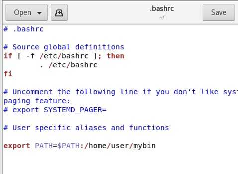

## Switch Stacking ha stp

## Crack zip

fcrackzip

## 增加系統變量

不過 ``echo $PATH`` 還不會看到 新增的系統變量

要讓剛剛編輯的檔案生效``. .bashrc``

## Standard input, output

0: keyboard input

1 : screen output

``echo "2" 1>a.txt`` == ``echo "2" > at.txt``

 `` ls /tmp /aaa 1>a.txt 2>&1`` == ``ls /tmp /aaa >a.txt 2>&1``

transfer from monitor to file and

``ls /tmp /aaa >/dev/null 2>&1`` 

不在乎錯誤輸出 

## Command

* ``file a.sh`` : to see file information
* ``which date``: know the location of the command(``date``), only search for executable file
* ``. .bashrc``  == ``source .bashrc``: 讓剛剛的編輯生效 (``.bashrc`` = filename) ``.`` 讓他生效
* ``df -h`` : to see disk used space information(ex: size, used, avail...) ``-h`` use KB MB GB to display
* ``du -h /home/user `` : 資料夾空間使用情形
* ``du -sh /home/user`` : 總結資料夾空間使用情形
* ``echo $?`` : 上一個指令是不是有正確執行 非零值 錯誤 零值正確